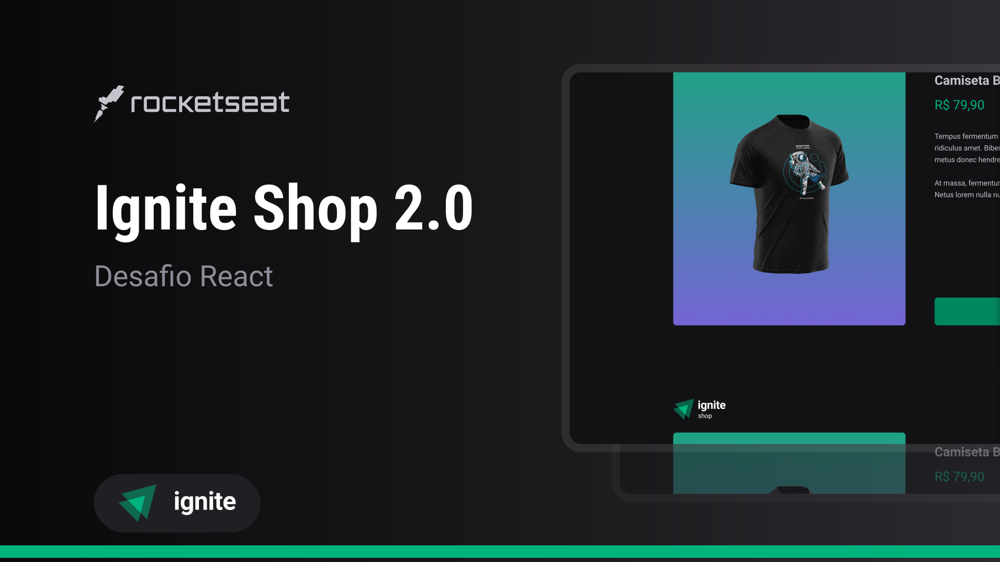

<h1 align="center"> Ignite Shop </h1>

  <a href="#-tecnologias">Tecnologias</a>&nbsp;&nbsp;&nbsp;|&nbsp;&nbsp;&nbsp;
  <a href="#-projeto">Projeto</a>&nbsp;&nbsp;&nbsp;|&nbsp;&nbsp;&nbsp;
  <a href="#-layout">Layout</a>

 

  

## 🚀 Tecnologias

Esse projeto foi desenvolvido com as seguintes tecnologias:

- TypeScript
- React
- Next.JS
- Stitches
- Axios
- Stripe
- Git e Github
- Figma

## 💻 Projeto

Ignite Shop 2.0 é uma aplicação web para compras de múltiplos produtos originais da Rocketseat.

- [Assistir aulas](https://app.rocketseat.com.br/classroom/projeto-04)

## 🔖 Layout

Você pode visualizar o layout do projeto através [DESSE LINK](https://www.figma.com/file/FxlDRKOmznBbTH8DsTgnZU/Ignite-Shop-2.0/duplicate). É necessário ter conta no [Figma](https://figma.com) para acessá-lo.
